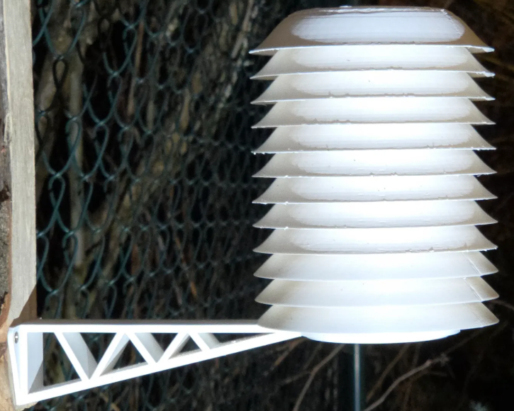

# Escudo de Radiación para Sensores Ecowitt

Escudo de radiación (radiation shield) imprimible en 3D para proteger sensores de temperatura y humedad Ecowitt de la radiación solar directa.

## Compatibilidad

- **WN31** — Termohigrómetro de canal
- **WN32** — Termohigrómetro exterior
- **WN35** — Termohigrómetro con sonda

## Uso recomendado

Ideal para **estaciones remotas** donde el sensor se instala a la intemperie sin la protección del kit original WS69. Por ejemplo:

- Un **GW1100** con sensor **WN32** como estación secundaria
- Sensores **WN31** adicionales en exteriores

El escudo protege el sensor del calor radiante del sol, evitando lecturas de temperatura infladas y mejorando la precisión de las mediciones de humedad relativa.

## Material de impresión

| Material | Recomendación |
|----------|---------------|
| **PETG** | Buena resistencia UV y térmica |
| **ASA**  | Excelente para exteriores, muy resistente a UV |
| **PLA**  | No recomendado para exteriores (se degrada con UV y calor) |

**Color:** blanco o color claro para máxima reflexión del calor.

## Archivos STL

| Archivo | Descripción |
|---------|-------------|
| `rad_shield_top_bowl.stl` | Tazón superior (tapa) |
| `rad_shield_middle_bowl.stl` | Tazón intermedio (lamas) |
| `rad_shield_bottom_bowl.stl` | Tazón inferior (base) |
| `rad_shield_cap-holder.stl` | Soporte para el sensor |
| `rad_shield_mount.stl` | Soporte de montaje |
| `rad_shield_redukce.stl` | Adaptador/reductor |

## Fuente original

Diseño disponible en Printables: [Ecowitt Sensor Radiation Shield](https://www.printables.com/model/1616544-ecowitt-sensor-radiation-shield)

## Instalación

1. Imprime el escudo en PETG o ASA blanco
2. Monta el sensor Ecowitt en el interior del escudo
3. Instala el conjunto en una ubicación con buena circulación de aire
4. Orienta las lamas hacia abajo para evitar acumulación de agua

## Licencia

Ver licencia del modelo original en Printables.
