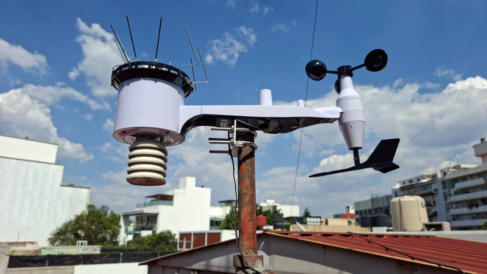
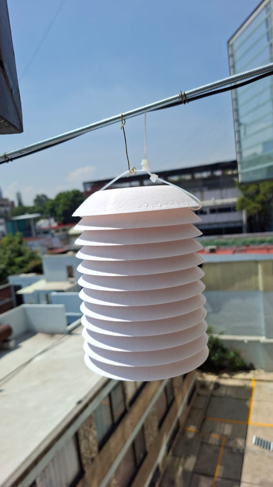
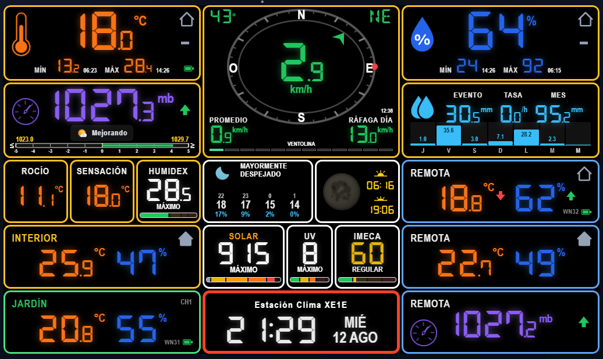
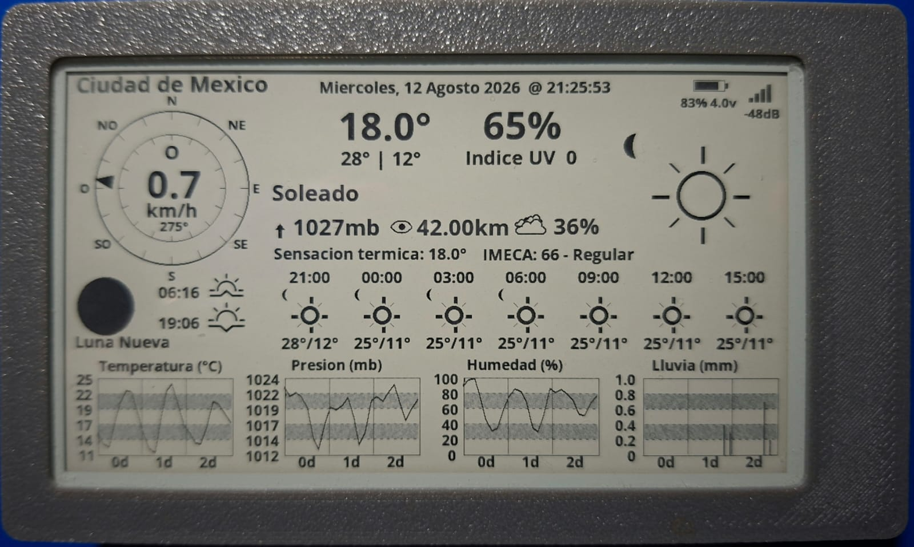
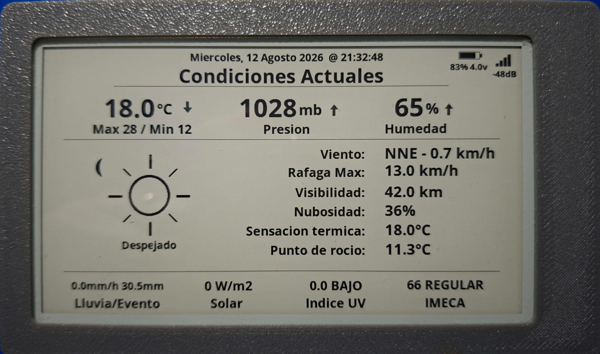

# Estación Clima XE1E — Ciudad de México

<p align="center">
  
  
</p>
<p align="center">
  <em>Estación Principal (WS69)</em> · <em>Estación Remota (WN32 con escudo de radiación)</em>
</p>

Estación meteorológica propia que publica en tiempo casi real las condiciones de un punto exacto de la Ciudad de México (Benito Juárez). El hardware **Ecowitt** envía sus datos por *push* a un servidor en un **VPS con HTTPS**, que los guarda en **InfluxDB** y los muestra en un sitio web propio (React), con pronóstico, radar, astronomía, climatología, calidad del aire y meteorología aeronáutica. El mismo servidor alimenta además **pantallas físicas** (kiosco táctil, e-paper y reloj de píxeles) y **Home Assistant**.

**🌦️ Sitio en vivo:** [clima.xe1e.net](https://clima.xe1e.net)

Stack propio: **FastAPI + InfluxDB + React** (Vite · TypeScript · Tailwind). Todo el dato de las páginas de Historia, Estadísticas y Climatología proviene de la propia estación.

---

## El sitio

La app principal vive en `/pro` (instalable como PWA) y tiene:

| Página | Qué muestra |
|--------|-------------|
| **Inicio** | Condiciones actuales, viento (brújula-instrumento que gira a la rosa de vientos), presión con tendencia, pronóstico y **comparativa Open-Meteo vs SMN**, precipitación, UV/radiación solar, sol y luna, **METAR** del aeropuerto, calidad del aire, IMECA, sismos, cámara del exterior, interior y sensores adicionales. Incluye los **índices derivados**: punto de rocío, sensación térmica y **humidex** (con su nivel en palabras) |
| **Mi tablero** | Tablero personalizable: elige qué tarjetas ver y **arrástralas para reordenarlas** a tu gusto (se guarda por dispositivo) |
| **Pronóstico** | Por día y por hora, con **selector de fuente**: **Open-Meteo** (descripciones en lenguaje natural) y **SMN oficial** (CONAGUA) con **buscador de cualquier municipio de México** |
| **Historia** | Archivo de la estación con granularidad Día/Mes/Año, tabla diaria y gráficas interactivas (incl. tasa de lluvia) |
| **Estadísticas** | Resumen del año, promedios mensuales, contadores de días, grados-día y récords históricos, **rosa de vientos apilada por bandas de velocidad**, y **humidex** (récord de bochorno y días con humidex ≥ 30) |
| **Tablas** | Resumen tabular de todas las variables (actual, mín/máx del día), con selector entre **estación principal y remota** |
| **Climatología** | Climograma, récords por mes, reporte estilo NOAA y "en este día" |
| **Radar y satélite** | Radar (Ventusky) e imagen satelital diaria (NASA GIBS) |
| **Cámara** | Vista del exterior de la estación: foto cada 5 min empujada desde la red local (la cámara nunca se expone a internet), con aviso si la última captura envejece. **Análisis del cielo con IA** (Gemini/Claude): tipo de nubes, cobertura, visibilidad, pronóstico visual, histórico diario y validación vs modelos |
| **Astronomía** | Sol y luna con arcos, fases lunares y almanaque (pyephem) |
| **Calidad del aire** | AQI (WAQI) e **IMECA** estimado (norma NADF-009-AIRE-2017) con medidor y pronóstico |
| **Aeronáutica** | METAR y TAF decodificados + perfil atmosférico visual, para aeropuertos de México |
| **Estación remota** | Segunda estación (p. ej. un Ecowitt **GW1100**) que envía al mismo servidor; sus datos se guardan **por separado** y se ven en su propia página, solo lectura: condiciones, tendencias, estadística e histórico |
| **Consola** | Réplica en pantalla de la consola física Ecowitt (rejilla 3×5) — el mismo componente que se pinta en el kiosco |
| **Widget** | Generador de un `<iframe>` con las condiciones actuales para insertar en otra web |

Además: **panel de administración** (`/admin`, usuario/contraseña) con **wizard de configuración inicial** (5 pasos: bienvenida, estación, alertas, publicación, resumen) y 8 páginas: Dashboard (indicador en tiempo real, historial de alertas, acciones rápidas), Estaciones (agregar/eliminar secundarias, configuración individual con servicios por estación), Alertas (umbrales), Calibración (offsets/multiplicadores), Publicación (redes públicas), Notificaciones (Telegram y correo SMTP, con envío de prueba y selector de categorías por canal), Integraciones (MQTT/HA con estado de conexión, test y reconexión en caliente; WAQI), y Sistema (QC, visor de logs). Todo editable en caliente sin reiniciar. **Tema claro/oscuro**, **unidades** métricas/imperiales, y una **Vista clásica** simple en `/`.

**Alertas** configurables (temperatura, viento, ráfaga, lluvia, presión, humedad, UV/radiación, batería baja, sensor perdido, estación caída, calidad del aire, y **visuales** —tormentas, precipitación, visibilidad—) con notificación por **Telegram** y por **correo (SMTP)**. Cada categoría de alerta se **enruta por canal**: puedes mandar unas a Telegram, otras al correo, o a ambos.

**Publicación a redes públicas**: Weather Underground, PWSWeather, Windy, OpenWeatherMap y CWOP/APRS.

---

## Hardware

| Componente | Modelo |
|------------|--------|
| Consola + sensor exterior | Ecowitt **WS2910** (kit con **WS69**) |
| Sensor T/H interior o por canal | Ecowitt **WN31** (hasta 8 canales) |
| Gateway (upgrade opcional) | Ecowitt **GW3000** — API local / microSD / Ethernet |
| Estación remota (opcional) | Ecowitt **GW1100** — 2ª estación que envía al mismo servidor (secundaria) |
| Cámara del exterior (opcional) | **Tapo C325WB** — vive tras el NAT de casa; algo en la red local saca el JPEG del RTSP y lo empuja al servidor |
| Kiosco de pared (opcional) | **Waveshare ESP32-S3 táctil 7"** (1024×600) |
| Display e-paper (opcional) | **LilyGo 4.7"** — se despierta, pide una vez y vuelve a dormir |
| Reloj de píxeles (opcional) | **Ulanzi TC001** (matriz 32×8) con firmware SVITRIX-XE1E |

Frecuencia 915 MHz (América). El **WS2910 basta por sí solo**: envía por *push* con protocolo Ecowitt, sin necesidad de estar en la misma red que el servidor.

### Pantallas dedicadas (opcional)

Además del sitio web, el servidor alimenta pantallas físicas que muestran el clima sin abrir un navegador. Las tres son opcionales y ninguna hace falta para que el sistema funcione.

**Kiosco Waveshare ESP32-S3 (táctil 7")** — funciona como *display tonto*: el **servidor renderiza** cada pantalla en Chromium headless (servicio `renderer`) y la sirve como JPEG (`GET /api/display.jpg?page=<slug>`); el ESP32 solo la baja y la pinta. El firmware **no sabe qué páginas existen** — con cada imagen recibe la cabecera `X-Kiosk-Nav` con las zonas táctiles, así que añadir pantallas es sólo cambiar el servidor. Arranca en la **réplica de la consola**, que hace de índice hacia detalle histórico por variable, récords, pronóstico, sensores y cámara. La pantalla lleva además su propio **BME280**, cuyas lecturas envía de vuelta (`POST /api/kiosk/local`) y se ven en el sitio. Firmware: [ecowitt-display-kiosk-xe1e](https://github.com/XE1E/ecowitt-display-kiosk-xe1e).

<p align="center">
  
</p>

**E-paper LilyGo 4.7"** — cliente "gordo": dibuja él mismo la pantalla. El servidor le da el dato ya masticado en `GET /api/epaper/forecast.json`, con la forma de WeatherAPI `forecast.json` (basta apuntar ahí la URL del firmware). Ese endpoint **nunca devuelve 503**: si falta algún dato cae al pronóstico y lo marca, porque un error dejaría la pantalla vieja hasta el siguiente despertar.

<p align="center">
  
  
</p>

**Reloj Ulanzi TC001 (SVITRIX-XE1E)** — matriz LED de 32×8 con apps rotativas de temperatura, humedad, presión, calidad del aire, UV, viento, radiación y precipitación. Consulta `GET /api/svitrix` cada 1–5 min. Firmware: [svitrix-firmware-XE1E](https://github.com/XE1E/svitrix-firmware-XE1E).

### Impresión 3D

**Escudo de radiación** para sensores WN31/WN32/WN35: protege el sensor de la radiación solar directa en instalaciones a la intemperie. Archivos STL en [`3d-prints/radiation-shield/`](3d-prints/radiation-shield/) y en [Printables](https://www.printables.com/model/1616544-ecowitt-sensor-radiation-shield).

---

## Arquitectura

```
WS69 (exterior)   WN31 (interior)          Cámara C325WB (casa)
       │               │                          │ RTSP → JPEG
       │ RF 915 MHz     │                          │ (empuja, tras NAT)
       ▼               ▼                          │
┌──────────────────────────────┐                  │
│  WS2910 (consola + display)  │                  │
│  push protocolo Ecowitt      │                  │
└──────┬───────────────────────┘                  │
       │ HTTP POST /data/report/                  │ POST /api/camera/upload
       ▼                                          ▼
┌────────────────────────────────────────────────────────┐
│                    SERVIDOR (VPS)                      │
│  Receiver (FastAPI) ── InfluxDB                        │
│         │                                              │
│  API REST + Dashboard (React) + Renderer (Chromium)    │
└────────────────────────────────────────────────────────┘
       │ HTTPS (Cloudflare)
       ▼
   clima.xe1e.net · Home Assistant (REST/MQTT)
   Kiosco Waveshare (JPEG) · E-paper LilyGo · Reloj Ulanzi
```

---

## Fuentes de datos externas

Todo lo medido es de la estación. Lo externo (referencia) es: **Open-Meteo** (pronóstico y astronomía base), **SMN / CONAGUA** (pronóstico oficial por municipio, cualquier municipio de México), **WAQI** (AQI) y **Open-Meteo Air Quality** (IMECA estimado), **NASA GIBS** (satélite), **Ventusky** (radar), **USGS/SSN** (sismos), **aviationweather.gov/NOAA** (METAR/TAF) y **pyephem** (almanaque, cálculo local).

---

## Puesta en marcha

Requisitos: Docker y Docker Compose en un servidor accesible por internet, y (para HTTPS) un dominio.

```bash
git clone https://github.com/XE1E/ecowitt-weather-server-xe1e.git
cd ecowitt-weather-server-xe1e

cp .env.example .env      # edita tus valores (InfluxDB, admin, tokens, etc.)

docker compose up -d --build
curl http://localhost:8080/health
```

**Grafana (opcional)**: el `docker-compose.yml` trae un servicio Grafana ya apuntado a InfluxDB, apagado por defecto tras el perfil `grafana` — el sitio no lo necesita, es para hurgar en el dato crudo. Se levanta aparte y queda en el puerto 3000, en red privada (no lo publica el reverse proxy):

```bash
docker compose --profile grafana up -d     # credenciales: GRAFANA_ADMIN_* del .env
```

**Configurar la estación** (app *WS View Plus* → Weather Services → Customized):

- Enable: ON · Protocol: **Ecowitt** · Server IP: *tu servidor* · Port: **8080** · Path: **/data/report/** · Interval: **60 s**

**Ubicación** (pronóstico/astronomía) en [`dashboard/src/config.ts`](dashboard/src/config.ts):

```ts
export const LOCATION = {
  name: 'Ciudad de México',
  latitude: 19.4326,
  longitude: -99.1332,
}
```

Detalle completo de despliegue: **[docs/DEPLOY.md](docs/DEPLOY.md)** · dominio + HTTPS: **[docs/DOMINIO-HTTPS.md](docs/DOMINIO-HTTPS.md)**.

---

## Integración con Home Assistant

HA lee los datos desde la **API REST del VPS** (por HTTPS). Config lista para usar (integración `rest:`): [`homeassistant/ecowitt.yaml`](homeassistant/ecowitt.yaml). Ejemplo mínimo:

```yaml
sensor:
  - platform: rest
    name: "Temperatura Exterior"
    resource: https://clima.xe1e.net/api/current
    value_template: "{{ value_json.temperature_outdoor }}"
    unit_of_measurement: "°C"
    scan_interval: 60
```

Alternativa **MQTT Discovery**: si corres un broker accesible por HA, el receiver puede auto-crear las entidades. Actívalo en `.env` (`MQTT_ENABLED=true`, `HASS_DISCOVERY=true`, …).

---

## API (principales)

| Método | Endpoint | Descripción |
|--------|----------|-------------|
| POST | `/data/report/` | Recibe el push de la estación |
| GET | `/api/current` | Lectura actual |
| GET | `/api/history` · `/api/stats/daily` | Histórico y estadísticas del día |
| GET | `/api/climate/*` | Resúmenes diarios, récords y reporte NOAA |
| GET | `/api/forecast` · `/api/almanac` | Pronóstico y almanaque |
| GET | `/api/smn` · `/api/smn/municipios` | Pronóstico oficial SMN por municipio (4 días + 48 h) |
| GET | `/api/airquality` · `/api/airquality/imeca` | AQI e IMECA |
| GET | `/api/metar` · `/api/taf` · `/api/satellite` | METAR/TAF y satélite |
| GET | `/api/svitrix` | Dato actual con forma WeatherAPI `current.json` (+ extras) para el reloj SVITRIX (Ulanzi TC001) |
| GET | `/api/epaper/forecast.json` | Dato con forma WeatherAPI `forecast.json` para el display e-paper LilyGo |
| GET | `/api/display.jpg?page=<slug>` | Pantalla del kiosco ya renderizada como JPEG (+ cabecera `X-Kiosk-Nav`) |
| POST/GET | `/api/camera/upload` · `/api/camera/latest.jpg` | Sube y sirve la foto del exterior (token propio `CAMERA_UPLOAD_TOKEN`) |
| GET | `/api/camera/analysis` · `/api/camera/analysis/validation` | Análisis del cielo con IA + validación vs pronóstico |
| GET | `/api/camera/analysis/history` | Histórico diario de análisis (lista días o `?date=YYYY-MM-DD`) |
| GET | `/health` | Estado del servicio |

> **Multi-estación:** `/api/current`, `/api/history` y `/api/stats/daily` aceptan `?station=<nombre>` para consultar una **estación secundaria** (p. ej. `gw1100`); sin el parámetro devuelven la **principal**.

Referencia completa: **[docs/api-reference.md](docs/api-reference.md)**.

---

## Estructura del proyecto

```
├── docker-compose.yml          # Orquestación
├── receiver/                   # Servidor (FastAPI)
│   ├── app/
│   │   ├── main.py             # App y endpoints
│   │   ├── config.py
│   │   └── services/           # parser, storage, aggregator, alerts,
│   │                           # imeca, metar, satellite, almanac, …
│   └── tests/
├── dashboard/                  # Frontend (React · Vite · TS · Tailwind)
│   ├── src/pages/ · src/pages/kiosk/ · src/components/station/
│   ├── src/kiosk-nav.ts        # Qué pantallas tiene el kiosco y cómo se navegan
│   └── public/                 # guía, manifiesto PWA, iconos, fuentes DSEG
├── renderer/                   # Chromium headless → /api/display.jpg (kiosco)
├── homeassistant/              # Config para Home Assistant
├── 3d-prints/                  # STL del escudo de radiación
├── docs/                       # Documentación (y docs/archivo/ = estudios)
├── caddy/ · uptime-worker/     # Reverse proxy y monitor de disponibilidad
└── scripts/                    # Utilidades (simulador, sonda WS2910, captura de cámara)
```

---

## Documentación

- **[Guía completa](docs/GUIA.md)** — manual de referencia (hardware, arquitectura, cada página, API, operación)
- [Análisis del cielo con IA](docs/guias/analisis-cielo.md) — cómo funciona, nowcasting, alertas visuales
- [Referencia de API](docs/api-reference.md)
- [Despliegue en el VPS](docs/DEPLOY.md) · [Dominio + HTTPS](docs/DOMINIO-HTTPS.md) · [VPS Oracle](docs/oracle-vps-setup.md)
- [Configurar el gateway/consola](docs/setup-gateway.md)
- [Backups a R2](docs/backups-r2.md) · [Monitor de uptime](uptime-worker/README.md)

> Notas de estudio y planeación (exploratorias) quedan archivadas en [`docs/archivo/`](docs/archivo/).

---

## Licencia

MIT.
